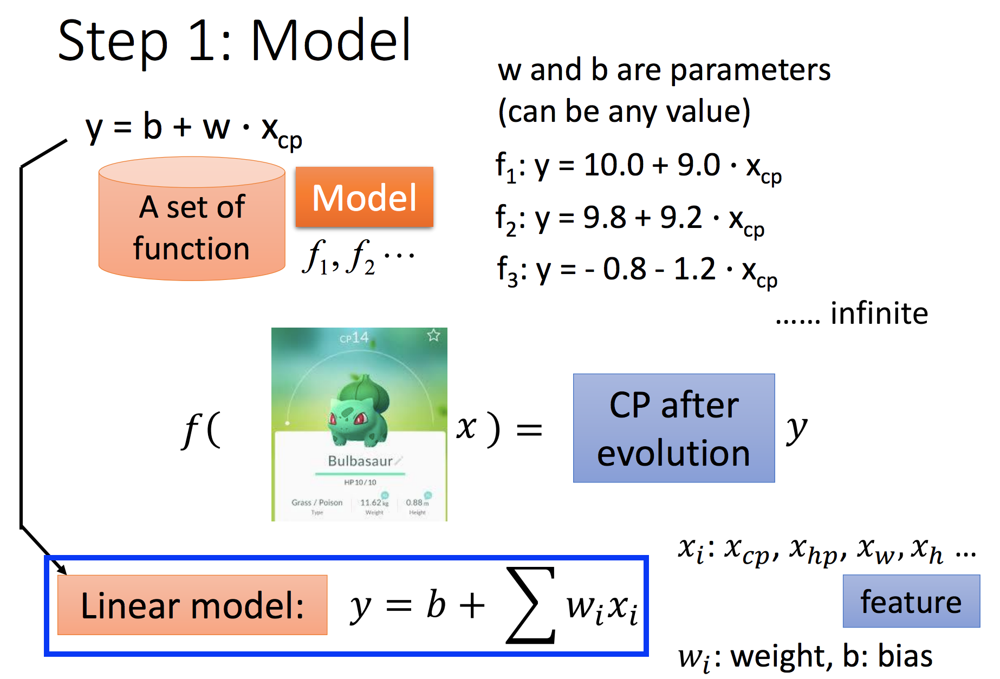
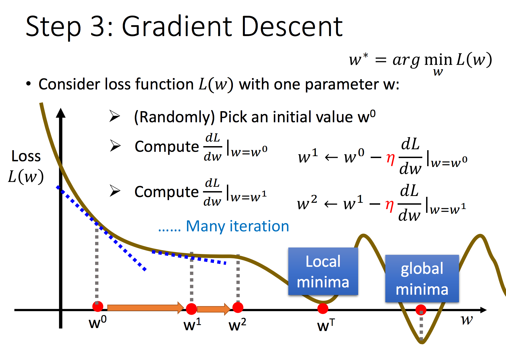
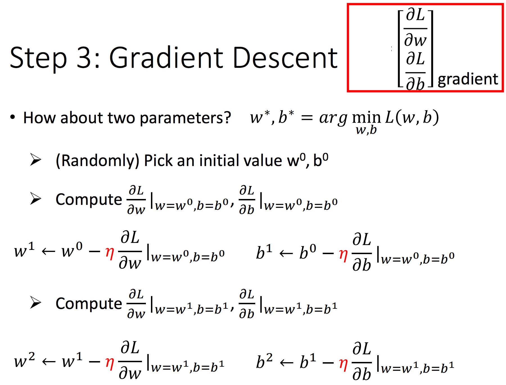
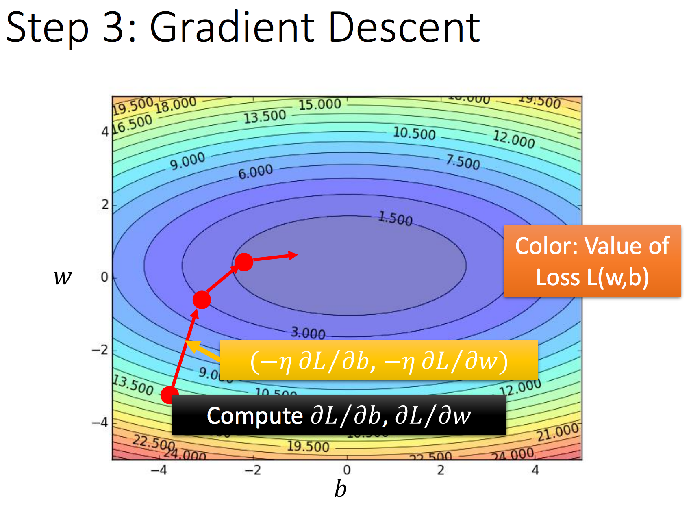
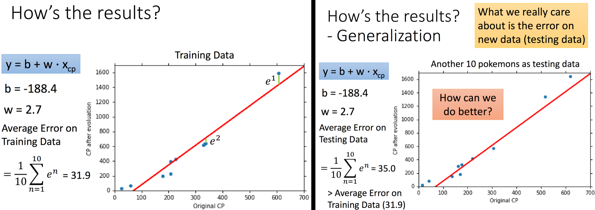
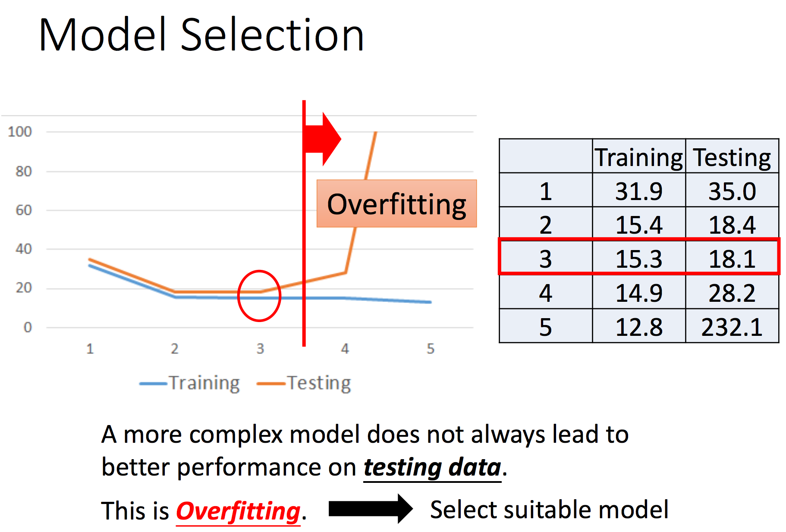

## 线性回归

---

> 机器学习**三步骤**

---

### 0 问题定义

图1 现实中的回归问题

 

由图1可知，现实中的很多应用场景可归纳为回归问题，其显著特点是**模型的预测结果为一个连续值**。本章节以CP值预测为例对回归问题涉及到的问题展开讨论，如图2所示。

 图2 回归问题示例：CP值预测

 

### 1 问题求解

**STEP 1 Model**

 图3 建立模型

 
**STEP 2 Goodness of function**

 图4 定义损失函数

 
**STEP 3 Best function**

 图5 定义优化算法（更新参数w和b）

 

### 2 优化算法：梯度下降

利用梯度下降更新参数的流程分别如图6与图7所示：

 图6 仅对参数w进行更新

 

 图7 同时对参数w和b进行更新

 

图8为参数w和b的更新过程可视化：

 图8 参数w和b更新过程

 

梯度下降的三种特殊情形：`plateau point`，`saddle point`，`local minima`，如图9所示：

 图9 梯度下降的三种特殊情形

 

在以上三种情形中，现在所介绍的梯度下降算法将无法得到最优的结果，第三章节将重新对梯度下降算法进行深入讨论。

### 3 模型评价

对模型的评价需要从两个方面考虑：**训练集阶段**与**测试集阶段**，如图10所示：

 图10 模型评价

 

- 训练集阶段：用于检测模型的拟合（学习）效果
- 测试集阶段：用于评判模型的最终性能

若模型在训练集阶段检测的效果很好，而测试集阶段效果很差，则说明所训练的模型发生**过拟合（overfit）**，如图11所示：

 图11 过拟合

 

### 4 模型优化

当模型在测试集阶段检测的效果较差时，显然需要对模型进行优化，优化的思路有如下两点：

- 在训练集阶段效果怎样？是否有提升的空间？
- 是否发生过拟合？

#### 4.1 提升训练集模型效果
在不更改模型的情况下，可通过一定的数据预处理与寻找更多的有效特征来提升模型的训练效果，俗称**特征工程**。
#### 4.2 避免过拟合
过拟合的原因是模型过于复杂，一种有效避免模型过拟合的办法是添加**正则项**。
