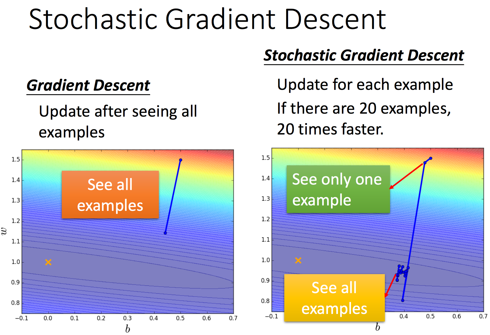
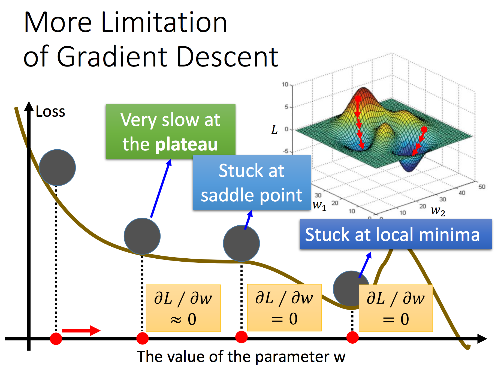

## 优化算法：gradient descent

---

> 机器学习**三步骤**
<div  align="center"></div>

---

### 0 回顾

`gradient descent`用于最小化`loss function`，其实现过程分别如图1、2所示：

<div  align="center">
<center>

<p>图1 gradient descent原理</p>
</center>
</div>
<br>
<div  align="center">
<center>

<p>图2 gradient descent计算过程可视化</p>
</center>
</div>
<br>

```
# gradient descent迭代流程
for 是否收敛：
  对参数分别计算梯度
  更新全部参数
结束
```

### Tips 1：调整`learning rate`

图3展示了不同的`learning rate`对迭代过程的影响：

<div  align="center">
<center>

<p>图3 learning rate vs loss function</p>
</center>
</div>
<br>

由图3可知，`learning rate`对最终的迭代结果有很大的影响，`learning rate`过大会导致算法无法收敛，而`learning rate`过小会导致算法收敛过慢。

> 在训练模型时，为了说明模型的收敛性，需要给出迭代次数-loss function图，如图3所示。

显然为了使模型获得更好的收敛效果，需要在训练过程中不断调整`learning rate`，有以下两种思路：

- 每次迭代时，逐渐减小`learning rate`
- 不同的参数，有不同的`learning rate`

<div  align="center">
<center>

<p>图4 自适应learning rate</p>
</center>
</div>
<br>

#### Adagrad

`Adagrad`是SGD的一个变种，其定义如图5所示：

<div  align="center">
<center>

<p>图5 Adagrad</p>
</center>
</div>
<br>

其具体计算（迭代）过程如图6所示：

<div  align="center">
<center>

<p>图6 Adagrad</p>
</center>
</div>
<br>

 下面对`Adagrad`从数学模型上进行深入的分析。
 
 首先，对`Adagrad`数学模型进行具化，如图7所示：
 
<div  align="center">
<center>

<p>图7 公式带入</p>
</center>
</div>
<br>

由图8展示了梯度大小与迭代步长间的关系，其中`Adagrad`中含有一对矛盾的变量：

<div  align="center">
<center>

<p>图8 Adagrad中梯度与步长</p>
</center>
</div>
<br>

下面通过一个实际的案例，对`Adagrad`的有效性进行解释。

对于图9所示的loss function，一次微分所得到的梯度不能得到最优的步长；图10为loss function的二维平面。

<div  align="center">
<center>

<p>图9 一次微分</p>
</center>

<div  align="center">
<center>

<p>图10 一次微分平面展示</p>
</center>
</div>
<br>

继续对loss function进行二次微分，结果如图11所示，图12是其二维展示。

<div  align="center">
<center>

<p>图11 二次微分</p>
</center>

<div  align="center">
<center>

<p>图12 二次微分平面展示</p>
</center>
</div>
<br>

> 结论：最优步长 = |一次微分| / 二次微分

然而在实际系统中，二次微分的计算复杂度较高，因此往往用一种近似来实现，如图13所示：


<div  align="center">
<center>

<p>图13 二次微分近似</p>
</center>
</div>
<br>

### Tips 2：Stochastic Gradient Descent

`Stochastic Gradient Descent`，以下简称`SGD`，其定义如图14所示。

<div  align="center">
<center>

<p>图14 SGD定义</p>
</center>
</div>
<br>

与`GD`相比，两者间的主要区别在于参数更新时所使用的样本数，两者迭代过程对比如图15所示。

<div  align="center">
<center>

<p>图15 SGD与GD迭代过程</p>
</center>
</div>
<br>

### Tip 3: Feature Scaling 特征归一化

图16展示了什么是`Feature Scaling`：

<div  align="center">
<center>

<p>图16 特征归一化</p>
</center>
</div>
<br>

那么迭代过程与特征归一化有什么关系呢？图17给出了解释，特征的大小会影响参数间的重要性关系，进而影响参数的迭代过程。

<div  align="center">
<center>

<p>图17 特征归一化与迭代过程</p>
</center>
</div>
<br>

图18展示了一种常用的特征归一化方法：

<div  align="center">
<center>

<p>图18 特征归一化方法</p>
</center>
</div>
<br>

最后，图19展示了`gradient descent-based`方法的局限性：

<div  align="center">
<center>

<p>图19 局限性</p>
</center>
</div>
<br>
