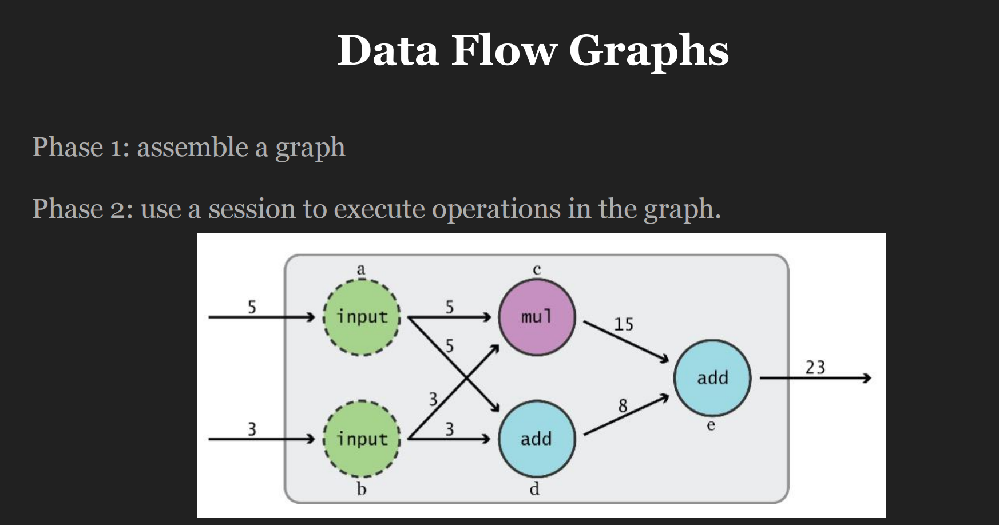
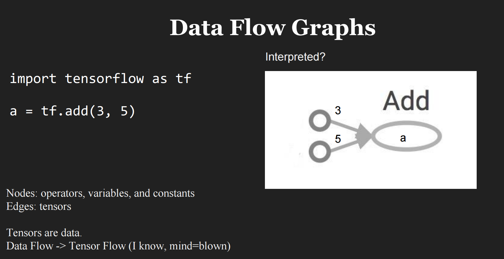
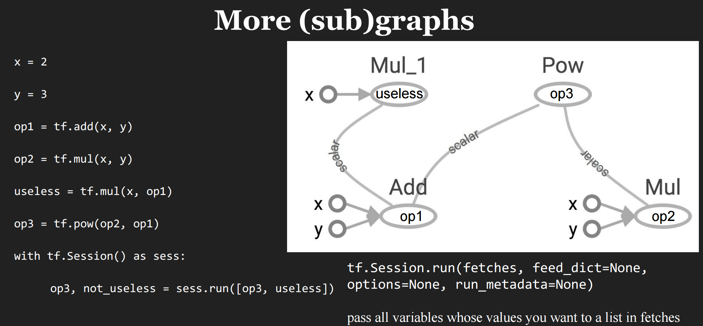
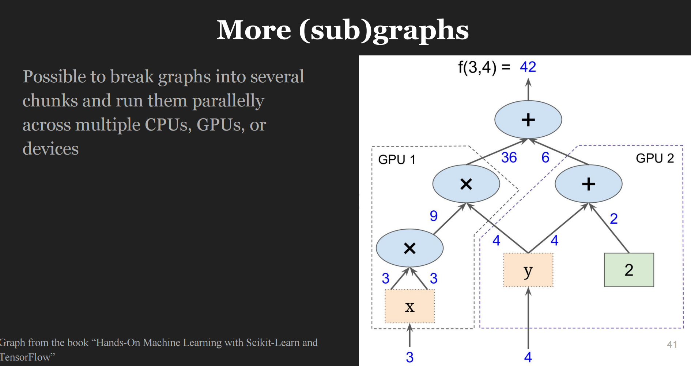
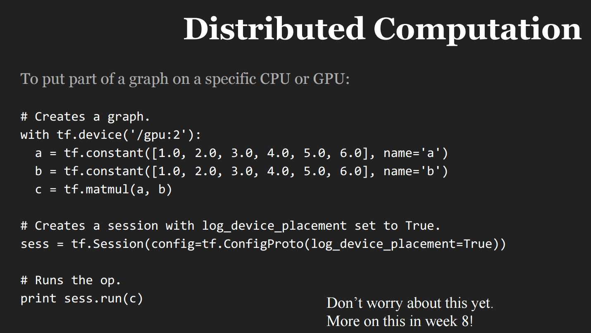
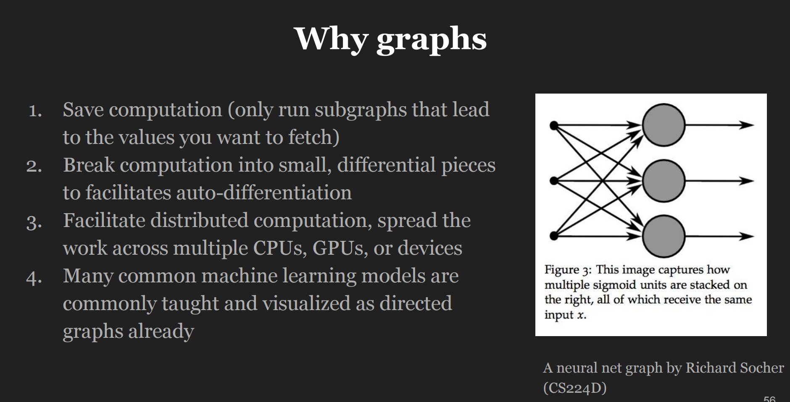

##  Introduction to TensorFlow

### 1 Graphs and Sessions

**TensorFlow**将计算过程分为两个阶段：`计算的定义`与`计算的执行`，其中`计算的定义`对应于`Graphs`，`计算的执行`对应于`Sessions`，如图1所示。

图1 Data Flow Graphs

 

图2为一个`Graphs`的示例，其中`Node`表示定义的操作，`Edge`表示数据流。

图2 Data Flow Graphs示例

 

图3为一个多子图的`Graphs`示例，通过`tf.Session.run()`方法可以指定计算哪几个子图。

图3 sub-Graphs

 

### 2 Distributed Computation

图4 分布式计算图示

 

图5 分布式计算代码示例

 

上述的分布式计算过于naive，对于模型开发者来说，其不关心如何分配GPU来完成模型的计算，**TensorFlow**需要一个基于GPU的类`Spark`系统模块。

### 3 Why graphs？

图6 Why graphs？

 

总结如下：

- Save computation 避免不必要的计算
- Facilitates auto-differentiation 拆分成多个子图，加快自动微分
- Facilitate distributed computation 加快分布式（异构）运算
- 直观，使计算过程更容易理解
