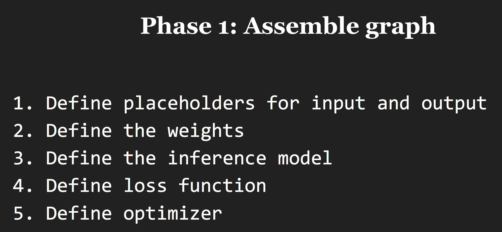
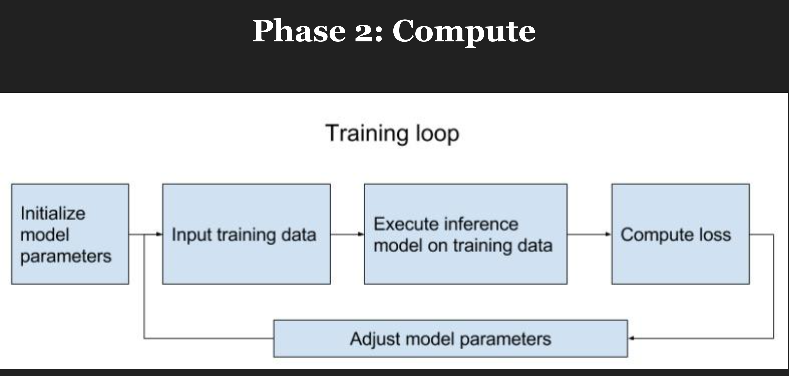
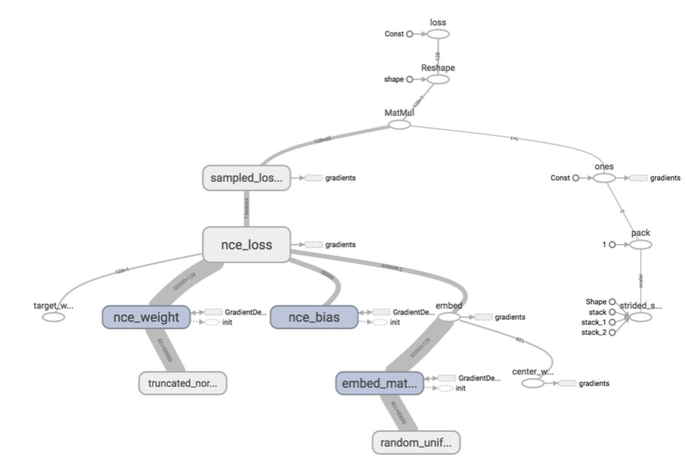
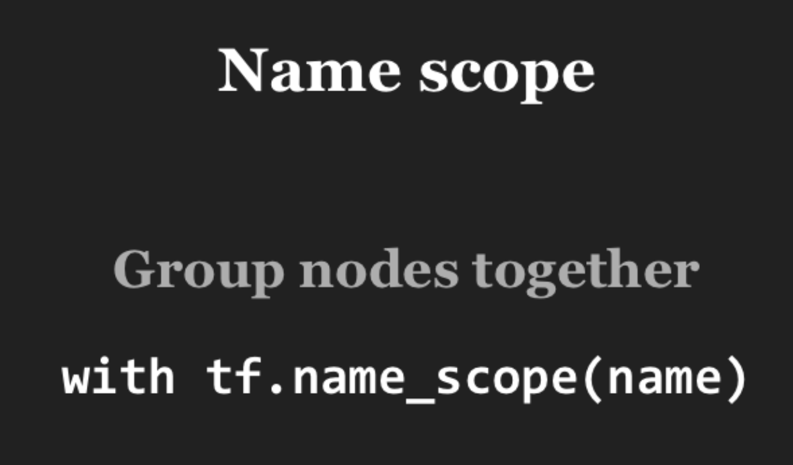

## Structure your TensorFlow model

### 1. TensorFlow模型结构

主要分为两个阶段：**图构建**与**计算/训练**，分别如图1、2所示：

图1 图构建

图2 计算/训练

### 2. 示例：Word Embedding

> `Word Embedding`: Capture the semantic relationships between words. 
获取字/词间的语义关系。

`Word Embedding`的实现方法有以下几种：

- CBOW
- skip-gram
  - softmax-based
  - sample-based
  
tensorflow实现的word2vec网络结构如图3所示：
  

图3 word2vec的网络结构

  
  另外，可通过`name scope`对网络结构进行整理，`name scope`的介绍如图4所示，整理后的网络结构如图5所示。
  
  

图4 name scope

图5 整理后的网络结构

