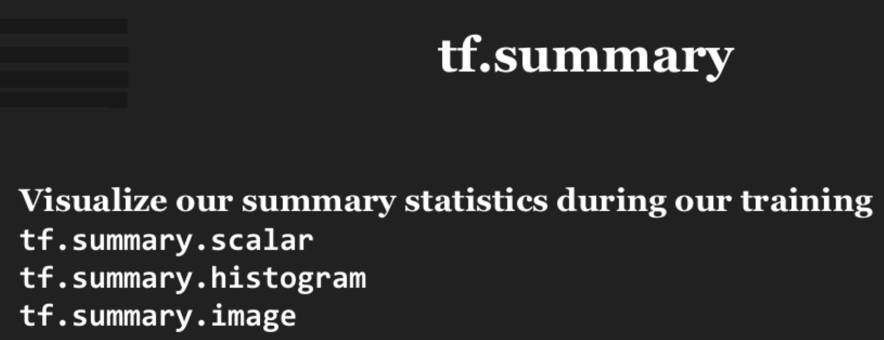

##  Manage Experiments and Process data

### 1. 梯度

在结构图中，梯度的计算如图1所示：

<div  align="center">

<p>图1 图构建</p>
</div>

在tensorflow中的通过`tf.gradients(y, [xs])`方法自动计算梯度，如图2所示：

<div  align="center">

<p>图2 tensorflow中自动梯度计算</p>
</div>

示例代码如下所示：

```python
import tensorflow as tf

x = tf.Variable(2.0)
y = 2.0 * (x ** 3)
z = 3.0 + y ** 2
grad_z = tf.gradients(z, [x, y])

with tf.Session() as sess:
     sess.run(x.initializer)
     print sess.run(grad_z) # >> [768.0, 32.0]
     
# 768 is the gradient of z with respect to x, 32 with respect to y
```

图3展示了梯度消失/爆炸问题：

<div  align="center">

<p>图3 梯度爆炸问题</p>
</div>

> 参考文献： Understand the exploding gradient problem

### 2. 结构化模型

结构化的目的是增强模块的可重复利用性，即采用面向对象编程模型进行开发，如图4所示：

<div  align="center">

<p>图4 模型对象化</p>
</div>

### 3. 实验管理

#### checkpoints
通过`tf.train.Saver`实现，示例代码如下所示：

```python
# define model

# create a saver object
saver = tf.train.Saver()

# launch a session to compute the graph
with tf.Session() as sess:
    # actual training loop
     for step in range(training_steps):
           sess.run([optimizer])
           if (step + 1) % 1000==0:
                saver.save(sess, 'checkpoint_directory/model_name',
                                global_step=model.global_step)
```

从某一个checkpoints点恢复的示例代码如下所示：

```python
saver.restore(sess, 'checkpoints/name_of_the_checkpoint')
# e.g. saver.restore(sess, 'checkpoints/skip-gram-99999')
```

#### summary

`summary`模块主要是对训练的结果进行总结分析，如图5所示：

<div  align="center">

<p>图5 summary模块</p>
</div>

其具体步骤分别如图6、7、8所示：

<div  align="center">

<p>图6 step1</p>
</div>

<div  align="center">

<p>图7 step2</p>
</div>

<div  align="center">

<p>图8 step3</p>
</div>

保存的数据，可在tensorbord中查看。

#### 随机变量的控制

- op-level随机种子
如`my_var = tf.Variable(tf.truncated_normal((-1.0,1.0), stddev=0.1, seed=0))`，示例：

```python
c = tf.random_uniform([], -10, 10, seed=2)
with tf.Session() as sess:
     print sess.run(c) # >> 3.57493
     print sess.run(c) # >> -5.97319
----
c = tf.random_uniform([], -10, 10, seed=2)
with tf.Session() as sess:
     print sess.run(c) # >> 3.57493
with tf.Session() as sess:
     print sess.run(c) # >> 3.57493
```

- graph-level随机种子
通过`tf.set_random_seed(seed)`进行设置；

#### 数据读取
常见的几种数据读取方法如下所示：

```
tf.TextLineReader
Outputs the lines of a file delimited by newlines
E.g. text files, CSV files

tf.FixedLengthRecordReader
Outputs the entire file when all files have same fixed lengths
E.g. each MNIST file has 28 x 28 pixels, CIFAR-10 32 x 32 x 3

tf.WholeFileReader
Outputs the entire file content

tf.TFRecordReader
Reads samples from TensorFlow’s own binary format (TFRecord)

tf.ReaderBase
To allow you to create your own readers
```

按照队列的方式读取数据：
```python
filename_queue = tf.train.string_input_producer(["file0.csv", "file1.csv"])
reader = tf.TextLineReader()
key, value = reader.read(filename_queue)
```
