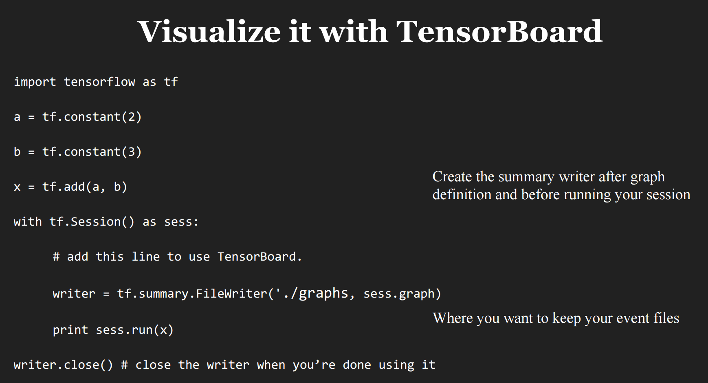
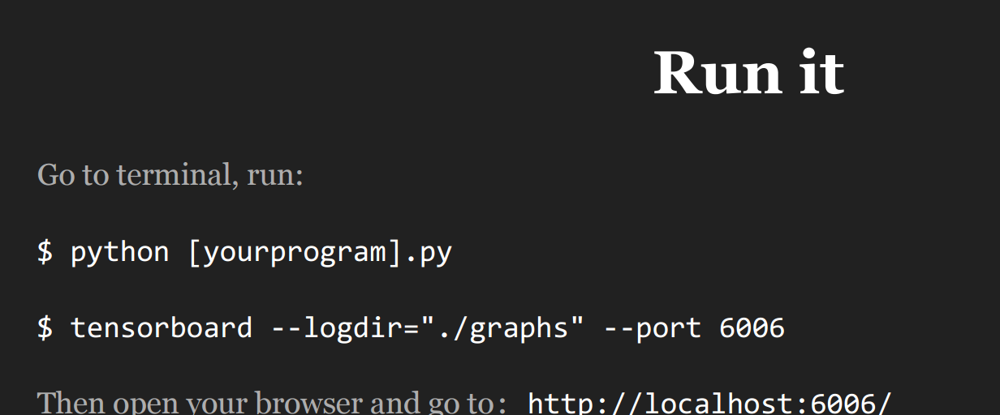
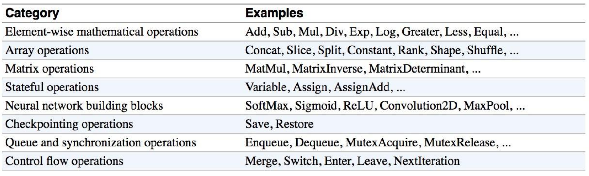
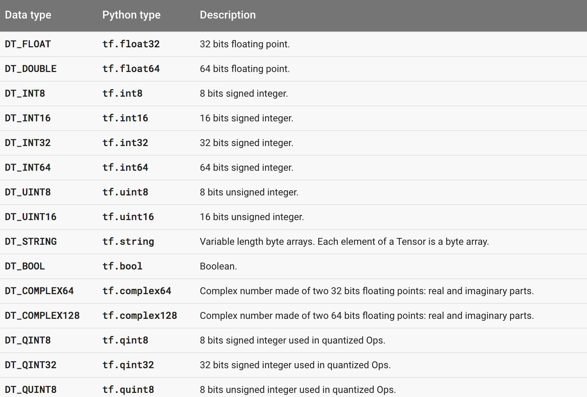
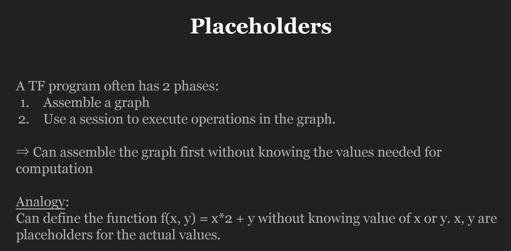
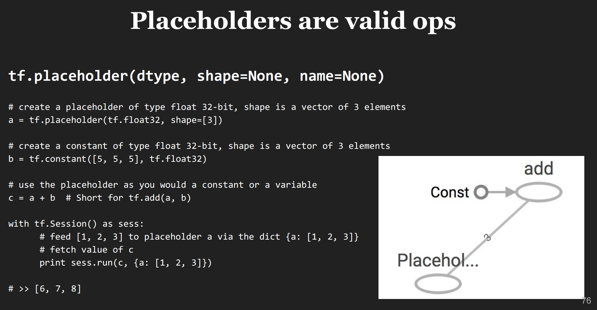
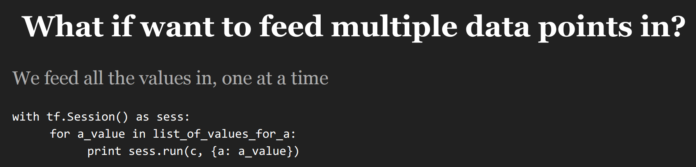
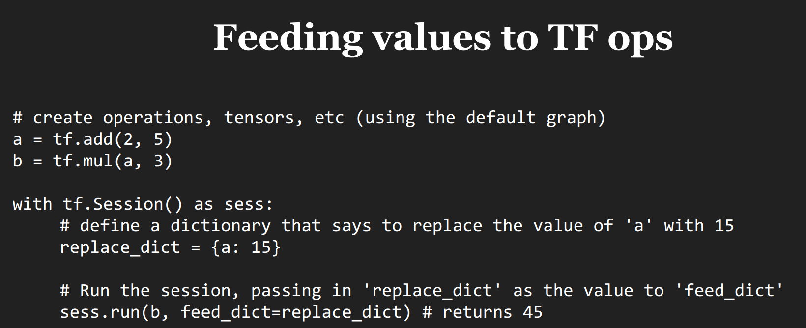
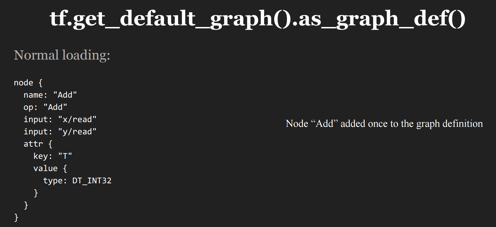
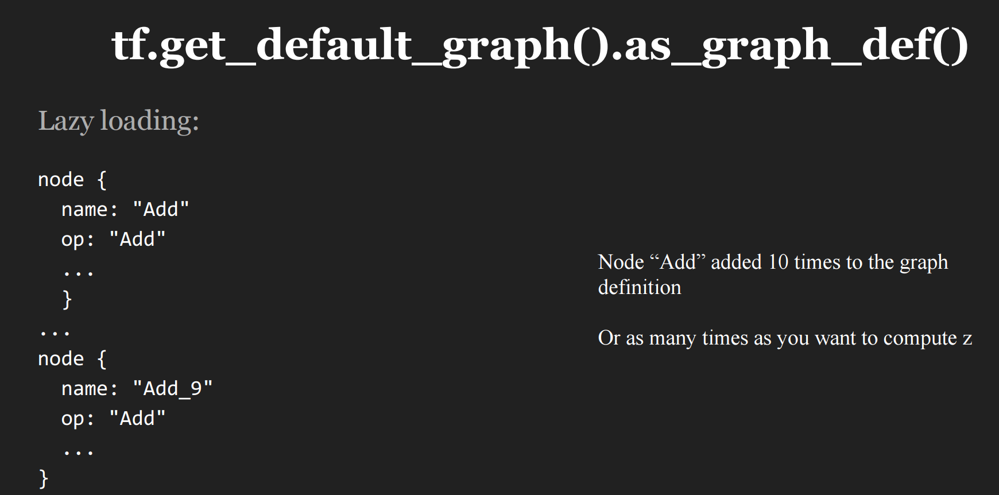

## TensorFlow Ops


### 1 `Tensorboard`

`Tensorboard`是一个用于可视化复杂tensorflow模型计算流程的web组件，图1为在`Graph`中添加该模块的示例。

<div  align="center">

<p>图1 添加Tensorboard</p>
</div>
<br>

<div  align="center">

<p>图2 进入Tensorboard界面</p>
</div>
<br>

### 2 Constant types 常量的类型

常量可分为以下三种：

- Constant Value Tensors 生成常量tensor
- Sequences 生成常量序列
- Random Tensors 生成随机tensor

具体使用方法参见[API](https://www.tensorflow.org/api_guides/python/constant_op)。

### 3 Math Operations 数学运算

具体使用方法参见[API](https://www.tensorflow.org/api_guides/python/math_ops)。

<div  align="center">

<p>图3 数学运算分类</p>
</div>
<br>

### 4 Data Types 数据类型

主要介绍Python Native Types、Numpy Native Types和TensorFlow Native Types三者间的关系，现在的版本中，三者间可以互转，不过推荐优先使用自带的数据类型。

参见[API](https://www.tensorflow.org/versions/r0.11/resources/dims_types)

<div  align="center">

<p>图4 数据类型</p>
</div>
<br>

### 5 Variables 变量

除了其他编程语言中变量与常量的常见区别外，`TensorFlow`中的常量还有一个特点：**常量会保存在图的定义中**，因此当图中定义的常量多或值较大时会影响图的加载性能。

```python
import tensorflow as tf

my_const = tf.constant([1.0, 2.0], name="my_const")
print tf.get_default_graph().as_graph_def() // 输出图的定义
```

> Only use constants for primitive types. Use variables or readers for more data that requires more memory.

**定义变量**
变量的定义通过`tf.Variable()`类实现：
```python
# create variable a with scalar value
a = tf.Variable(2, name="scalar")

# create variable b as a vector
b = tf.Variable([2, 3], name="vector")

# create variable c as a 2x2 matrix
c = tf.Variable([[0, 1], [2, 3]], name="matrix")

# create variable W as 784 x 10 tensor, filled with zeros
W = tf.Variable(tf.zeros([784,10]))
```

**变量初始化**

在使用变量之前必须对其进行初始化，其初始化方式有三种：

- 同时初始化所有变量
  ```python
  init = tf.global_variables_initializer()

  with tf.Session() as sess:
    tf.run(init)
  ```
- 初始化部分变量
  ```python
  init_ab = tf.variables_initializer([a, b], name="init_ab")

  with tf.Session() as sess:
    sess.run(init_ab)
  ```
- 初始化单变量
```python
  W = tf.Variable(tf.zeros([784,10]))

  with tf.Session() as sess:
    sess.run(W.initializer)
  ```

**变量赋值**

变量的赋值操作主要通过`tf.Variable()`类中定义的方法实现，如`assign(...) `等。

```python
W = tf.Variable(10)
assign_op = W.assign(100) # 变量赋值

with tf.Session() as sess:
  sess.run(assign_op)
  print W.eval() # >> 100

# ----

# create a variable whose original value is 2
a = tf.Variable(2, name="scalar")

# assign a * 2 to a and call that op a_times_two
a_times_two = a.assign(a * 2)

init = tf.global_variables_initializer()

with tf.Session() as sess:
  sess.run(init)
  # have to initialize a, because a_times_two op depends on the value of a
  sess.run(a_times_two) # >> 4
  sess.run(a_times_two) # >> 8
  sess.run(a_times_two) # >> 16

# ----

# create a variable whose original value is 2
my_var = tf.Variable(2, name="my_var")

# assign a * 2 to a and call that op a_times_two
my_var_times_two = my_var.assign(2 * my_var)

with tf.Session() as sess:
  sess.run(my_var.initializer)
  sess.run(my_var_times_two) # >> 4

# ----

# W is a random 700 x 100 tensor
W = tf.Variable(tf.truncated_normal([700, 10]))
U = tf.Variable(2 * W) # not safe

# W is a random 700 x 100 tensor
W = tf.Variable(tf.truncated_normal([700, 10]))
U = tf.Variable(2 * W.intialized_value()) # safe

# ----

W = tf.Variable(10)

with tf.Session() as sess:
  sess.run(W.initializer)
  print sess.run(W.assign_add(10)) # >> 20
  print sess.run(W.assign_sub(2)) # >> 18
```

### 6 Session vs InteractiveSession

简化操作的调用，一般用于interactive shells或者IPython notebooks中：

```python
sess = tf.InteractiveSession()
a = tf.constant(5.0)
b = tf.constant(6.0)
c = a * b

# We can just use 'c.eval()' without specifying the context 'sess'
print(c.eval())
sess.close()
```

### 7 Control Dependencies

用于控制计算操作的执行顺序：

```python
# defines which ops should be run first
# your graph g have 5 ops: a, b, c, d, e

with g.control_dependencies([a, b, c]):
  # 'd' and 'e' will only run after 'a', 'b', and 'c' have executed.
  d = ...
  e = ...
```

### 8 Placeholders and feed_dict

<div  align="center">

<p>图5 placeholder</p>
</div>
<br>

顾名思义，`placeholder`的作用是**占位**，等到实际计算时，通过该占位符连接实际的数据。

<div  align="center">

<p>图6 placeholder的实现-一次将所有数据feed</p>
</div>
<br>

<div  align="center">

<p>图7 placeholder的实现-每次feed一个数</p>
</div>
<br>

另外，除了使用`placeholder`，其实任何feedable的tensor都可以使用feed_dict，如图8所示。

<div  align="center">

<p>图8 另一种feed数据的方法</p>
</div>
<br>

在使用该方式之前，比较安全的办法是先通过`tf.Graph.is_feedable(tensor) `判断该tensor是否满足feedable要求。

### 9 The trap of `lazy loading`

`lazy loading`是一种编程模式，指的是：**defer declaring/initializing an object until it is loaded**，该模式在tensorflow中也存在，如下示例所示。

```python
# Normal loading:
x = tf.Variable(10, name='x')
y = tf.Variable(20, name='y')
z = tf.add(x, y) # you create the node for add node before executing the graph

with tf.Session() as sess:
  sess.run(tf.global_variables_initializer())
  writer = tf.summary.FileWriter('./my_graph/l2', sess.graph)
  for _ in range(10):
    sess.run(z)
  writer.close()
```

```python
# Lazy loading:
x = tf.Variable(10, name='x')
y = tf.Variable(20, name='y')

with tf.Session() as sess:
  sess.run(tf.global_variables_initializer())
  writer = tf.summary.FileWriter('./my_graph/l2', sess.graph) 
  for _ in range(10):
    sess.run(tf.add(x, y)) # someone decides to be clever to save one line of code 
  writer.close()
```

两者之间的区别在于生成的图的结构，分别如图9、图10所示：

<div  align="center">

<p>图9 normal loading图结构</p>
</div>
<br>

<div  align="center">

<p>图10 lazy loading图结构</p>
</div>
<br>

对比图9与图10可知，`lazy loading`模式下，生成的图中额外添加了9个`Add`节点，因此`lazy loading`模式会使图的加载性能降低。

<br>
