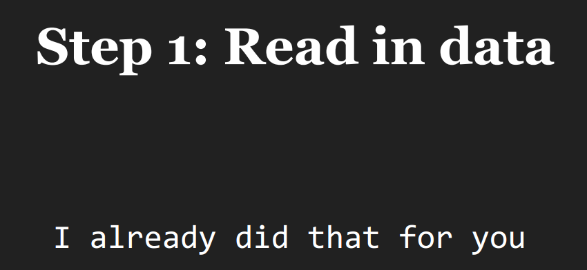
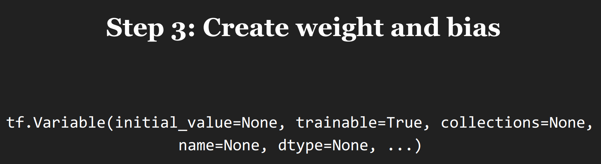
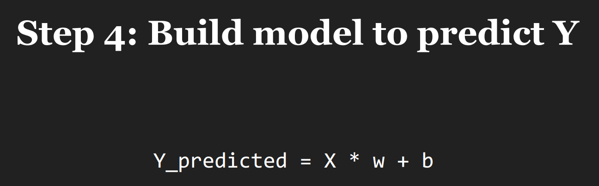
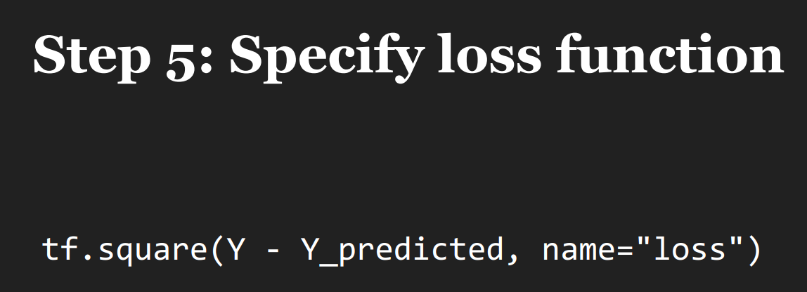
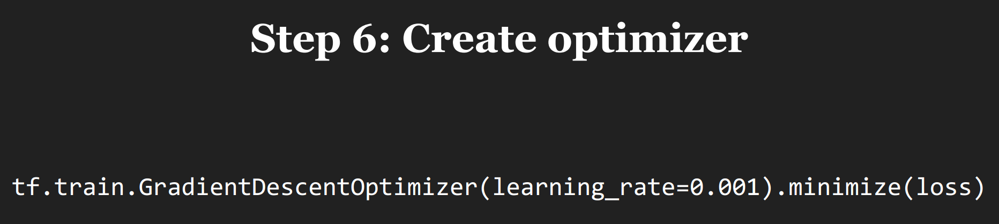
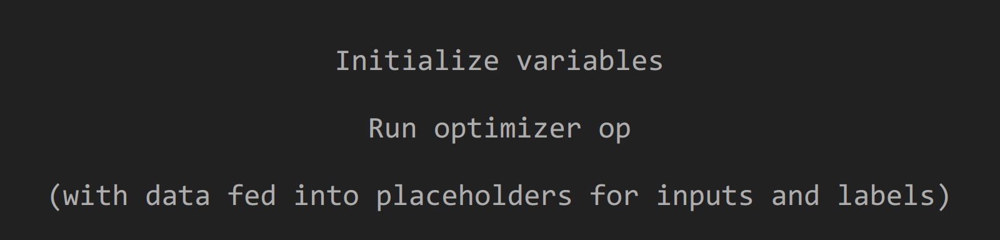
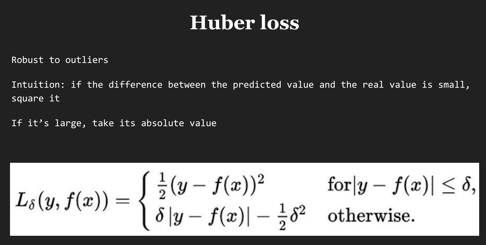
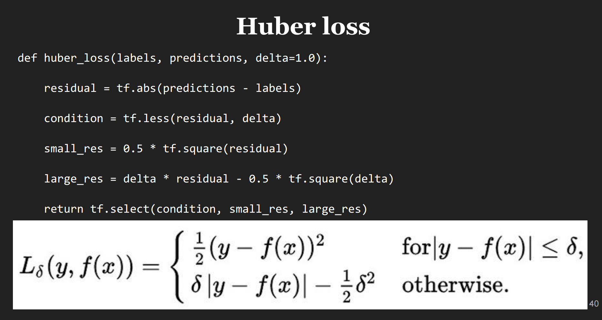

## Linear and Logistic Regression in TensorFlow

### 1 Linear Regression

**`Tensorflow`建模步骤**

- Phase 1: Assemble our graph

<div  align="center">

<p>图1 读取数据</p>
</div>

<div  align="center">

<p>图2 设置占位</p>
</div>

<div  align="center">

<p>图3 初始化训练参数</p>
</div>

<div  align="center">

<p>图4 模型初始化</p>
</div>

<div  align="center">

<p>图5 定义损失函数</p>
</div>

<div  align="center">

<p>图6 初始化优化器</p>
</div>
<br>

- Phase 2: Train our model

<div  align="center">

<p>图7 模型训练</p>
</div>
<br>

naive linear regression的代码示例：

```python
"""
Simple linear regression example in TensorFlow
"""

import xlrd
import numpy as np
import tensorflow as tf

# 1 load data
DATA_FILE = '../data/fire_theft.xls'
book = xlrd.open_workbook(DATA_FILE, encoding_override="utf-8")
sheet = book.sheet_by_index(0)
data = np.asarray([sheet.row_values(i) for i in range(1, sheet.nrows)])
n_samples = sheet.nrows - 1
print data

# 2 placeholder
X = tf.placeholder(tf.float32, name='X')
Y = tf.placeholder(tf.float32, name='y')

# 3 variables
w = tf.Variable(0.0, name='weights')
b = tf.Variable(0.0, name='bias')

# 4 model
Y_predict = w * X + b

# 5 loss
loss = tf.square((Y - Y_predict), name='square_loss')

# 6 optimizer
optimizer = tf.train.GradientDescentOptimizer(learning_rate=0.01).minimize(loss=loss)

# 7 train model
with tf.Session() as sess:
    # initial variables
    sess.run(tf.global_variables_initializer())

    # update parameters
    for i in range(100):  # train the model 100 times
        total_loss = 0
        for x, y in data:
            _, l = sess.run([optimizer, loss], feed_dict={X: x, Y: y})
            total_loss += l

        print 'Epoch {0}: {1}'.format(i, total_loss / n_samples)

    w_final, b_final = sess.run([w, b])
    print 'weights: {0}, bias: {1}'.format(w_final, b_final)
```

- [ ] 参数如何更新？
- [ ] 模型如何预测？

**模型优化**

- 优化器对比
  ```shell
  # GradientDescentOptimizer(learning_rate=0.01)
  Epoch 0: 1.33212877126e+22
  Epoch 1: inf
  Epoch 2: inf
  Epoch 3: inf
  Epoch 4: nan
  Epoch 5: nan
  Epoch 6: nan
  .....
  Epoch 99: nan
  weights: nan, bias: nan

  # GradientDescentOptimizer(learning_rate=0.001)
  Epoch 0: 2069.6319334
  Epoch 1: 2117.0123582
  Epoch 2: 2092.302723
  Epoch 3: 2068.50804619
  Epoch 4: 2045.59118409
  Epoch 5: 2023.51464481
  Epoch 6: 2002.24476198
  .....
  Epoch 99: 1413.1202843
  weights: 1.71838128567, bias: 15.7891569138
  
  # AdamOptimizer(learning_rate=0.01)
  Epoch 0: 1494.75234768
  Epoch 1: 1275.48403168
  Epoch 2: 1098.89700744
  Epoch 3: 953.873067697
  Epoch 4: 836.244767493
  Epoch 5: 741.952912654
  Epoch 6: 667.215013667
  .....
  Epoch 99: 383.062510141
  weights: 1.69907593727, bias: 9.44871711731
  
  # AdamOptimizer(learning_rate=0.001)
  Epoch 0: 1635.25415044
  Epoch 1: 1609.62615465
  Epoch 2: 1585.05052958
  Epoch 3: 1560.81882886
  Epoch 4: 1536.95552689
  Epoch 5: 1513.47169626
  Epoch 6: 1490.37104975
  .....
  Epoch 99: 507.461766403
  weights: 1.50052940845, bias: 2.71419858932
  ```

  对比可知，`AdamOptimizer`比`GradientDescentOptimizer`效果要好。另外当`GradientDescentOptimizer(learning_rate=0.01)`时，因`learning_rate`设置过大，损失值为`inf`，导致模型未能训练成功。

- loss function
  <div  align="center">
  
  <p>图8 huber loss定义以及应用场景</p>
  </div>
  
  <div  align="center">
  
  <p>图9 huber loss的tensorflow实现</p>
  </div>
  <br>

其他优化，如特征提取与选择参见[这里](https://github.com/d2Code/class-notes/blob/master/Machine-Learning-2017-Spring-Hung-yi-Lee/1-Regression/regression.md)

### 2 Logistic Regression


